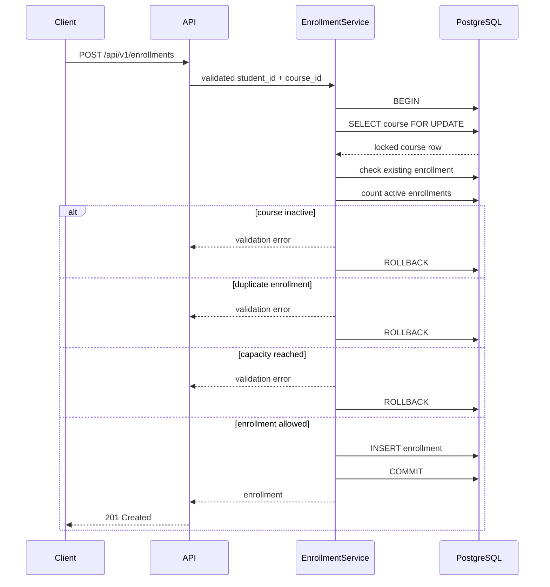

# Architecture

This rebuild intentionally stays small enough to inspect during a technical review.

## System view

```mermaid
flowchart LR
    Client[API client] --> Routes[/api/v1 routes]
    Routes --> Requests[Form Requests]
    Requests --> Controllers[Controllers]

    Controllers --> StudentModel[Student model]
    Controllers --> CourseModel[Course model]
    Controllers --> EnrollmentService[EnrollmentService]

    EnrollmentService --> EnrollmentModel[Enrollment model]
    EnrollmentService --> CourseModel

    StudentModel --> PostgreSQL[(PostgreSQL)]
    CourseModel --> PostgreSQL
    EnrollmentModel --> PostgreSQL

    Controllers --> Resources[API Resources]
    Resources --> Client
```

The HTTP layer stays thin. Validation happens before controller logic, resources normalize output, Eloquent maps persistence, and enrollment rules live in a small application service.

## Boundaries

The service exposes a versioned JSON API under `/api/v1`.

The domain contains three primary entities:

- Student
- Course
- Enrollment

HTTP validation is handled by Form Requests. Responses are normalized through API Resources. Eloquent models own persistence mapping and relationships. Enrollment business rules live in a small application service so the HTTP controller stays focused on transport concerns.

## Identifiers

Public domain records use ULIDs instead of sequential IDs. The identifiers remain sortable without exposing row counts through URLs.

## Enrollment consistency

Course capacity is enforced inside a database transaction.



The course row is locked before capacity is checked. Competing enrollment requests for the same course are therefore serialized around the capacity decision.

A unique database constraint on `student_id + course_id` provides an independent integrity boundary against duplicate records.

## Database

PostgreSQL is the default development database and the database used by CI.

Migrations define foreign keys, unique constraints and indexes used by common filters.

Students and courses use soft deletion so historical enrollment relationships are not casually discarded.

## API behavior

List endpoints use bounded pagination.

Student listing supports status and free-text filters.

Course listing supports active/inactive filtering.

Deleting an enrollment moves it to a cancelled state instead of deleting the record.

## Testing

Feature tests cover student creation, unique email validation, filtering, soft deletion, enrollment creation, duplicate prevention, capacity enforcement, cancellation, capacity release after cancellation and inactive-course rejection.

CI runs migrations and tests against PostgreSQL.

## Architecture decisions

- [ADR 0001: Serialize enrollment capacity checks with a row lock](adr/0001-enrollment-capacity-locking.md)
