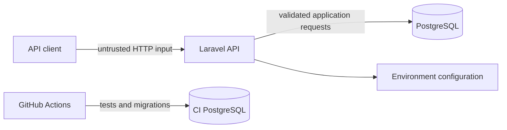

# Threat Model

This document records the current security model for the Student Management API.

The project is intentionally compact and does not claim to be a complete production security architecture. The purpose of this document is to make trust boundaries, assumptions and residual risks explicit.

## Assets

Primary assets include:

- student records;
- course records;
- enrollment records;
- database integrity;
- API availability;
- application configuration.

## Trust boundaries

The public HTTP boundary is untrusted.

The application is responsible for validating request data before persistence.

PostgreSQL remains an independent integrity boundary through constraints and transactional semantics.

## Current controls

### Input validation

Form Requests validate incoming API payloads before controller logic.

### Data integrity

The database enforces:

- foreign-key relationships;
- uniqueness constraints;
- schema-level types;
- transactional persistence.

The unique student/course enrollment constraint prevents duplicate relationships independently of HTTP validation.

### Concurrency

Enrollment capacity is protected through a transaction and a row-level `FOR UPDATE` lock on the course record before the active-enrollment count is evaluated.

See [ADR 0001](adr/0001-enrollment-capacity-locking.md).

### Configuration

Runtime configuration belongs in environment variables. Real credentials must not be committed.

### Dependency hygiene

Dependabot monitors Composer and GitHub Actions dependencies.

### CI

The CI pipeline runs migrations and automated tests against PostgreSQL before changes are considered healthy.

## Threats and current posture

| Threat | Current mitigation | Residual risk |
|---|---|---|
| Malformed input | Form Request validation | Business-specific validation may still evolve |
| Duplicate enrollment | Application check + database unique constraint | None expected for the defined invariant |
| Capacity race condition | Transaction + course row lock | Contention can increase under high concurrency |
| Orphaned relationships | Foreign keys | Soft-delete semantics still require domain awareness |
| Credential exposure | Environment-based configuration and ignored local env files | Git history must still be reviewed before production use |
| Dependency vulnerability | Dependabot | Advisory triage and upgrade decisions remain operational responsibilities |
| Unauthorized access | Not implemented | Authentication and authorization are required before public production deployment |
| Abuse / excessive traffic | Bounded pagination only | Production rate limiting is not implemented |
| Sensitive-data disclosure | Minimal API surface | Production privacy controls and access policies are not implemented |

## Production requirements not implemented

Before this API could be treated as a public production service, it would need additional controls such as:

- authentication;
- role-based authorization;
- rate limiting;
- centralized secrets management;
- structured audit logging;
- production telemetry;
- backup and restore procedures;
- incident response procedures;
- privacy and retention policies;
- environment-specific hardening.

## Review trigger

Revisit this threat model whenever a change introduces:

- authentication or authorization;
- external integrations;
- file uploads;
- asynchronous jobs;
- additional sensitive fields;
- public deployment;
- multi-tenancy;
- new trust boundaries.
